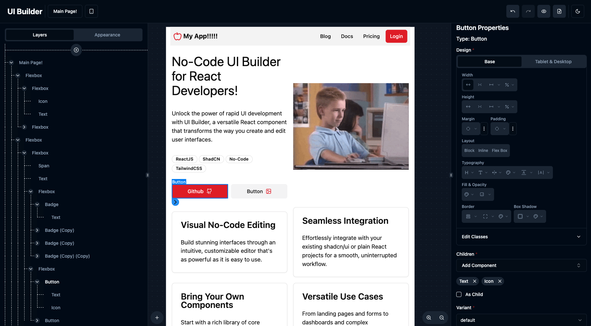

# UI Builder for @shadcn/ui

UI Builder is a React component that allows you to create and edit user interfaces through a visual no-code editor. It comes with a handful of core components and integrates easily with existing [shadcn/ui](https://ui.shadcn.com/) projects and can be extended to use your own custom components. 

You can use UI Builder to design and build UIs quickly. It's a great tool for creating landing pages, forms, dashboards, or anything else you can imagine. It can be used internally within your organization as a storybook alternative or a prototyping tool or as part of a product that provides users a no-code way to build their own applications, like Shopify, Builder.io, Framer, etc.

See the [demo](https://uibuilder.app/) to get an idea of how it works.




## Installation

If you are using the latest shadcn/ui in your project, you can install the component directly from the registry. 

```bash
npx shadcn@latest add https://raw.githubusercontent.com/olliethedev/ui-builder/main/registry/block-registry.json
```

Or you can start a new project with the UI Builder:

```bash
npx shadcn@latest init https://raw.githubusercontent.com/olliethedev/ui-builder/main/registry/block-registry.json
```

Note: You need to use [style variables](https://ui.shadcn.com/docs/theming) to have page theming working correctly.

If you are not using shadcn/ui, you can install the component simply by copying the files in this repo into your project.

### Fixing Dependencies after shadcn `init` or `add`

Add dev dependencies, since there currently seems to be an issue with shadcn/ui not installing them from the registry:

```bash
npm install -D @types/lodash.template @tailwindcss/typography @types/react-syntax-highlighter react-docgen-typescript tailwindcss-animate ts-morph ts-to-zod
```

And that's it! You have a UI Builder that you can use to build your UI.

## Usage

### Basic Example

```tsx
import UIBuilder from "@/components/ui/ui-builder";

export function App() {
  return <UIBuilder />;
}
```

By default the state of the UI is stored in the browser's local storage, so it will persist across sessions.

### Example with initial state and onChange callback

```tsx
import React from "react";
import UIBuilder from "@/components/ui/ui-builder";
import { PageLayer } from "@/lib/ui-builder/store/layer-store";

// Static initial layers or you can fetch from database
const initialLayers: PageLayer[] = [
  {
    id: "1",
    type: "_page_",
    name: "Page 1",
    props: {
      className: "p-4 flex flex-col gap-2",
    },
    children: [
      {
        id: "qCTIIed",
        type: "Button",
        name: "Button",
        props: {
            variant: "default",
            size: "default",
            className: "w-full items-center gap-2 max-w-sm",
        },
        children: [
            {
                id: "UzZY6Dp",
                type: "span",
                name: "span",
                props: {},
                children: "Hello World",
            },
            {
                id: "hn3PF6A",
                type: "Icon",
                name: "Icon",
                props: {
                    size: "medium",
                    color: "secondary",
                    rotate: "none",
                    iconName: "Github",
                    className: "",
                },
                children: [],
            },
        ],
        },
    ],
  },
];

const App = () => {
  const handleLayersChange = (updatedLayers: PageLayer[]) => {
    // Here you can send the updated layers to the backend
    console.log(updatedLayers);
  };

  return (
    <div>
      <UIBuilder initialLayers={initialLayers} onChange={handleLayersChange} />
    </div>
  );
};

export default App;

```

- `initialLayers`: Optional prop to set up initial pages and layers. Useful for setting the initial state of the builder, from a database for example.
- `onChange`: Optional callback triggered when the editor state changes, providing the updated pages. Can be used to persist the state to a database.
- `useCanvas`: Optional prop to disable the interactive canvas. Defaults to true.


You can also render the page layer without editor functionality by using the LayerRenderer component:

```tsx
import LayerRenderer from "@/components/ui/ui-builder/layer-renderer";
import { PageLayer } from "@/lib/ui-builder/store/layer-store";

const page: PageLayer = {...} // Fetch or define your page

export function MyPage() {
  return <LayerRenderer page={page} />;
}
```

`LayerRenderer` is useful when you want to render the finished page without any editor functionality.

## Add your custom components to the registry

Navigate to the [component-registry.tsx](lib/ui-builder/registry/component-registry.tsx) file and add your component definitions to the array. Here is an example of how to define a custom component:

```tsx

import { ComponentRegistry } from "@/lib/ui-builder/registry/component-registry";
import { z } from 'zod';
import { FancyComponent } from '@/components/ui/fancy-component';
import { classNameFieldOverrides, childrenFieldOverrides } from "@/lib/ui-builder/registry/form-field-overrides";

export const customComponentDefinitions: ComponentRegistry = {
    FancyComponent: {
        component: FancyComponent,
        schema: z.object({
            className: z.string().optional(),
            children: z.any().optional(),
            title: z.string().default("Default Title"),
            count: z.coerce.number().default(1),
            disabled: z.boolean().optional(),
            timestamp: z.coerce.date().optional(),
            mode: z
                .enum([
                    "fancy",
                    "boring"
                ])
                .default("fancy"),
        }),
        from: "@/components/ui/button",
        fieldOverrides: {
            className:(layer)=> classNameFieldOverrides(layer),
            children: (layer)=> childrenFieldOverrides(layer)
        }
    },
}

```

- `component`: The React component itself.
- `from`: The source path of the component. Used when exporting the page as code.
- `fieldOverrides`: Customizes auto-form fields for the component's properties.

- `schema`: A Zod schema defining the properties and validation rules for the component props. We use zod to define the component schema which represents the props that the component accepts. The required props **MUST** have a default value, this allows the UI Builder to render the component with the default value when the user adds the component to the page. This project leverages [Auto-Form](https://github.com/vantezzen/auto-form) to dynamically render component property forms based on the component definitions zod schema. Currently only these zod types are supported:
    - boolean
    - date
    - number
    - string
    - enum of supported zod types
    - object with properties of the supported zod types
    - array of objects with properties of the supported zod types

See core concepts below for more information on the component definitions.

## Optional: Generate the component registry for your components
To generate the component definition for your project components you can run the following command:

```bash
npx tsx lib/ui-builder/scripts/zod-gen.ts
```

This will generate the component definitions at the root of every folder in your /components directory. Note: You should wrap the generated schema `patchSchema` from schema-uitls.ts this will fix some issues with the generated schema and make sure they play well with auto-form. But in many complex component cases the generated files will need to be refactored manually. But the script will save you a lot of time compared to writing the definitions manually.
The script uses [ts-morph](https://www.npmjs.com/package/ts-morph) , [react-docgen-typescript](https://www.npmjs.com/package/react-docgen-typescript), and [ts-to-zod](https://www.npmjs.com/package/ts-to-zod) to generate the component definitions.


# UI Builder Technical Overview

----
Note: This project is an work in progress and the API will change.

----

## Core Concepts

### Layers

- **Layers** are the fundamental units representing components or pages within the UI structure.
- They form a hierarchical tree, allowing for complex and nested UI layouts.
- Each layer possesses properties and can contain child layers, enabling modular and scalable UI designs.


### Pages

- **Pages** are top-level layers that act as containers for other layers.
- They represent distinct sections or views within the application.
- Each page maintains its own set of properties and child layers, facilitating organized UI management.
- Pages can have theme settings.


### Components

- **Components** are reusable UI elements defined within the `component-registry`.
- They can be categorized as:
  - **Primitive Components**: Basic HTML elements like `<div>`, ``, etc.
  - **Advanced Components**: Complex UI elements like `<Button>`, `<Badge>`, etc.
- Components are registered with associated schemas, default properties, and behaviors, ensuring consistency and ease of use.


## Core Types

### `Layer` Types (`layer-store.ts`)


The `layer-store.ts` module defines the essential types used to manage UI layers.

```ts

export type Layer =
  | ComponentLayer
  | PageLayer;

export type ComponentLayer = {
  id: string;
  name?: string;
  type: keyof typeof componentRegistry;
  props: Record<string, any>;
  children: Layer[] | string;
};

export type PageLayer = {
  id: string;
  name?: string;
  type: '_page_';
  props: Record<string, any>;
  children: Layer[];
}

interface LayerStore {
  pages: PageLayer[];
  selectedLayerId: string | null;
  selectedPageId: string;
  initialize: (pages: PageLayer[]) => void;
  addComponentLayer: (layerType: keyof typeof componentRegistry, parentId: string, parentPosition?: number) => void;
  addPageLayer: (pageId: string) => void;
  duplicateLayer: (layerId: string, parentId?: string) => void;
  removeLayer: (layerId: string) => void;
  updateLayer: (layerId: string, newProps: Record<string, any>, layerRest?: Partial<Omit<Layer, 'props'>>) => void;
  selectLayer: (layerId: string) => void;
  selectPage: (pageId: string) => void;
  findLayerById: (layerId: string | null) => Layer | undefined;
  findLayersForPageId: (pageId: string) => Layer[];
}

```

- `Layer`: A union type representing any possible layer, encompassing component or page layers.
- `ComponentLayer`: Represents layers that are components.
- `PageLayer`: Represents layers that serve as pages containing other layers.
- `LayerStore`: Defines the structure of the state, including pages, selected layer/page IDs, and various actions to manipulate layers.


### `ComponentRegistry` Types (`component-registry.tsx`)

The `component-registry.tsx` module manages the registration and configuration of UI components.

```ts
export interface RegistryEntry<T extends ReactComponentType<any>> {
  component?: T;
  schema: ZodObject<any>;
  from?: string;
  defaultChildren?: (ComponentLayer)[];
  fieldOverrides?: Record<string, FieldConfigFunction>;
}

export type ComponentRegistry = Record<
  string,
  RegistryEntry<ReactComponentType<any>>
>;

export type FieldConfigFunction = (layer: ComponentLayer) => FieldConfigItem;

export const componentRegistry: ComponentRegistry = {
  // ...YourOtherProjectComponentDefinitions
  ...complexComponentDefinitions,
  ...primitiveComponentDefinitions,
} as const;

export const generateFieldOverrides = (layer: ComponentLayer): Record<string, FieldConfigItem> => {...}

```

- `RegistryEntry`: Defines the structure for each component's registry entry, including the component itself, its schema, source path, default children, and field overrides.
- `ComponentRegistry`: A record mapping component names to their respective RegistryEntry.
- `FieldConfigFunction`: A function type used to override default form fields based on the layer.

### Registration Structure
Each component is registered with the following details:
- `component`: The React component itself. Primitive components will not have this property.
- `schema`: A Zod schema defining the properties and validation rules for the component.
- `from`: The source path of the component. Used when exporting the page as code. Primitive components will not have this property.
- `defaultChildren`: An array of default child layers that the component should contain upon creation. This is useful for creating the initial scaffolding of a component hierarchy like a Card with CardTitle, CardDescription, and CardContent.
- `fieldOverrides`: Functions to customize auto-form fields when editing the component's properties.


### Example Registration

```ts
export const componentRegistry: ComponentRegistry = {
  Button: {
    component: Button,
    schema: z.object({
        className: z.string().optional(),
        children: z.any().optional(),
        asChild: z.boolean().optional(),
        variant: z
            .enum([
                "default",
                "destructive",
                "outline",
                "secondary",
                "ghost",
                "link",
            ])
            .default("default"),
        size: z.enum(["default", "sm", "lg", "icon"]).default("default"),
    }),
    from: "@/components/ui/button",
    defaultChildren: [
        {
            id: "button-text",
            type: "span",
            name: "span",
            props: {},
            children: "Button",
        } satisfies ComponentLayer,
    ],
    fieldOverrides: {
        className:(layer)=> classNameFieldOverrides(layer),
        children: (layer)=> childrenFieldOverrides(layer)
    }
  }
  // ... Other component definitions
};
```

### Button Component:
- `Schema`: Defines props like className, variant, and size with default values.
- `Default Children`: A span layer with default text "Button".
- `Field Overrides`: Customizes form fields for className and children properties.

## Changelog

### v0.0.2
- Removed _text_ layer type in favor of using span and Markdown components. You should migrate any layers stored in the database to use the new components. You can use the [migrateV1ToV2](lib/ui-builder/store/layer-utils.ts) function in layer-utils.ts to help with the migration.

## Development

Build component registry after updating lib or ui:

```bash
npm run build-registry
```

Host the registry locally:

```bash
npm run host-registry
```

Use the local registry in a local project:

```bash
npx shadcn@latest add http://127.0.0.1:8080/block-registry.json -o
```

## Running Tests

```bash
npm run test
```

## Roadmap

- [ ] Increase test coverage
- [ ] Refactor page layers to be more consistent with component layers
- [ ] Improve performance
- [ ] Add form component definitions since we already depend on most shadcn/ui form components
- [ ] Add option to add children component layers by reference to existing layers (this would be like figma component instances)
- [ ] Add event handlers to component layers (onClick, onSubmit, etc)
- [ ] Add data sources to component layers (ex, getUser() sets prop user)

## License

MIT
